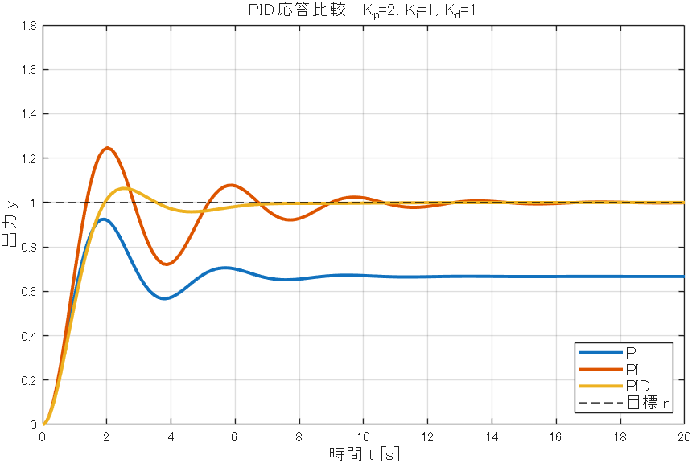
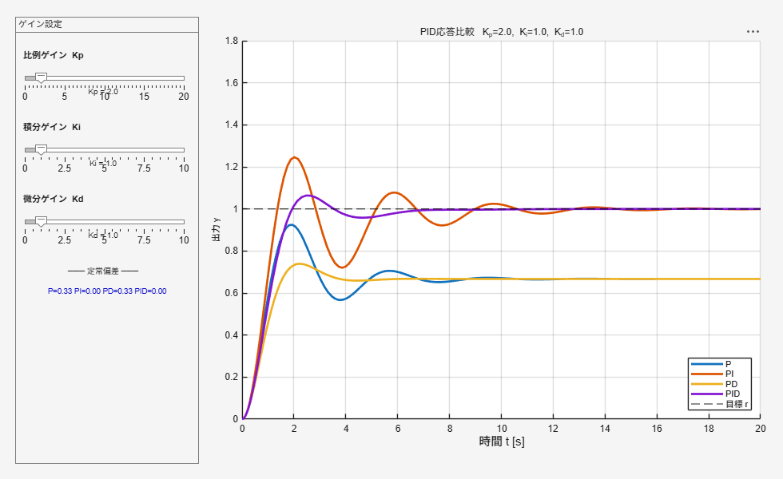

# PID Control — Response Comparison / PID制御 応答比較（P・PI・PD・PID）

Compare the closed-loop step response of **P**, **PI**, **PD**, and **PID** control on a
second-order plant by dragging the `Kp`, `Ki`, and `Kd` sliders.

2次遅れプラントに対する **P**・**PI**・**PD**・**PID** 制御の閉ループステップ応答を、
`Kp`・`Ki`・`Kd` のスライダーで比較できます。



---

## Overview / 概要

**EN** — The plant is a second-order system `ÿ + ẏ + y = u`, controlled toward a unit
step reference `r = 1`. The controller is `u = Kp·e + Ki·∫e dt + Kd·ė` with `e = r − y`
(derivative on measurement to avoid setpoint kick). Using the **same** gains, four
responses are drawn — P (Kp only), PI (Kp+Ki), PD (Kp+Kd), and PID (Kp+Ki+Kd) — so you
can see how each term changes the behavior. Solved with `ode45`; base MATLAB only.

**JA** — プラントは2次遅れ系 `ÿ + ẏ + y = u`、目標は単位ステップ `r = 1`。
コントローラは `u = Kp·e + Ki·∫e dt + Kd·ė`（`e = r − y`、微分は測定値微分でキック回避）。
**同じ**ゲインで P（Kpのみ）・PI（Kp+Ki）・PD（Kp+Kd）・PID（Kp+Ki+Kd）の4応答を描き、
各項の効果を見比べられます。`ode45` で数値積分、base MATLAB のみで動作します。

---

## What each term does / 各項の役割

| Term / 項 | Effect / 効果 |
|---|---|
| **P** (proportional / 比例) | Fast, but leaves a **steady-state offset** / 速いが**定常偏差**が残る |
| **I** (integral / 積分) | Removes the steady-state error, but adds **oscillation** / **定常偏差を除去**するが**振動**が増える |
| **D** (derivative / 微分) | Suppresses overshoot and **stabilizes** / **オーバーシュートを抑え安定化** |

> With the plant DC gain = 1, the P-only offset is `1/(1+Kp)` (e.g. `Kp=2 → 0.33`).
> **PD keeps the same offset** (no integral) but is smoother; adding integral (PI, PID)
> drives the offset to zero. / Pのみのオフセットは `1/(1+Kp)`（Kp=2で0.33）。
> **PD は積分が無いので同じオフセットが残り**ますが応答は滑らかになり、積分を加える
> （PI・PID）とオフセットはゼロになります。

---

## File List / ファイル構成

| File / ファイル | Role / 役割 |
|---|---|
| `pid_interactive_livescript.m` / `.mlx` | ★ Interactive Live Script; drag Kp/Ki/Kd, responses update automatically. / 埋め込みスライダーで即再実行するインタラクティブLive Script |
| `pid_static_script.m` | Classic section script — edit the gains and run. / クラシックな`%%`スクリプト（ゲインを書き換えて実行） |
| `pid_app.m` | Standalone GUI app with sliders and a steady-state-error readout. / スライダーと定常偏差表示付きの独立GUIアプリ |



---

## Getting Started / 使い方

**EN**
- **Interactive** → open `pid_interactive_livescript.mlx` in the Live Editor, drag Kp/Ki/Kd.
- **GUI app** → run `pid_app.m`; a window with three sliders opens.
- **Read-through / tweak** → run `pid_static_script.m` after editing the gains.

**JA**
- **インタラクティブ** → `pid_interactive_livescript.mlx` をLive Editorで開き、Kp/Ki/Kdを動かす。
- **GUIアプリ** → `pid_app.m` を実行。3スライダー付きウィンドウが開く。
- **通読・微調整** → `pid_static_script.m` のゲインを変更して実行。

---

## Requirements / 動作環境

- MATLAB **R2025a or later** recommended (plain-text Live Script). `.mlx`/app run on R2016b+.
- **No additional toolboxes** (base MATLAB, `ode45`). / 追加Toolbox不要。

---

## License / ライセンス

BSD 3-Clause License. See [../LICENSE.txt](../LICENSE.txt) (applies to the whole
collection). / BSD 3-Clause ライセンス（コレクション全体に適用）。

---

## Author & Citation / 著者・引用

- Author / 著者: **A. Suda**, National Institute of Technology (KOSEN), Nara College
- Contact / 連絡先: ats-suda@users.noreply.github.com

If you use this in teaching or research, a citation is appreciated / 教育・研究で
利用される場合は、以下のような引用をいただけると幸いです:

```
A. Suda (2026). MATLAB Educational Demos (Live Scripts & Apps) — PID Control.
MATLAB Central File Exchange. https://jp.mathworks.com/matlabcentral/fileexchange/184202-matlab-educational-demos-live-scripts-apps
```
