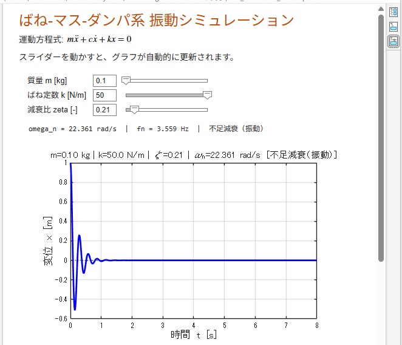
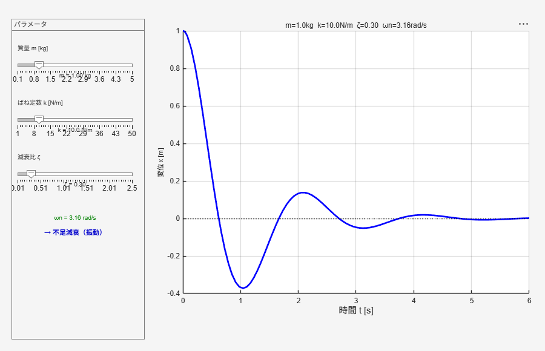

# Spring–Mass–Damper Vibration Simulators / ばね-マス-ダンパ系 振動シミュレータ集

Interactive teaching materials for the free vibration of a single-degree-of-freedom
spring–mass–damper (SMD) system, offered in three learning styles: a classic script,
Live Scripts, and a GUI app.

1自由度ばね-マス-ダンパ（SMD）系の自由振動を学ぶためのインタラクティブ教材集です。
「クラシックなスクリプト」「Live Script」「GUIアプリ」の3つの学習スタイルを用意しています。

---

## Overview / 概要

**EN** — The system obeys the equation of motion `m·x'' + c·x' + k·x = 0`, solved
numerically with `ode45`. By changing the mass `m`, stiffness `k`, and damping ratio
`ζ`, you can observe how the response changes between **under-damped**, **critically
damped**, and **over-damped** behavior. The same physics is presented in several
formats so learners can pick the style that suits them.

**JA** — 運動方程式 `m·x'' + c·x' + k·x = 0` を `ode45` で数値的に解きます。質量 `m`、
ばね定数 `k`、減衰比 `ζ` を変えることで、応答が **不足減衰**・**臨界減衰**・**過減衰**
へと変化する様子を観察できます。同じ物理を複数の形式で提供し、学習者が自分に合った
スタイルを選べるようにしています。

---

## Features / 特長

- **Three learning styles / 3つの学習スタイル**
  - Static report / 静的レポート（3パターン比較）
  - Interactive Live Script with embedded sliders / スライダー埋め込みのインタラクティブLive Script
  - Standalone GUI app / 独立GUIアプリ
- **No extra toolboxes / 追加Toolbox不要** — base MATLAB only（`ode45`, `uifigure`）
- **Japanese UI & comments / 日本語UI・コメント**
- **Real-time parameter exploration / パラメータをリアルタイムに探索**（m, k, ζ）

---

## Requirements / 動作環境

| | |
|---|---|
| MATLAB | **R2025a or later recommended** / **R2025a 以降推奨**（plain-text Live Script `.m` 対応） |
| | `.mlx` と GUI app のみなら R2016b+ でも動作 / `.mlx` and apps also work on R2016b+ |
| Toolboxes | **None / 不要**（base MATLAB のみ） |
| Tested on / 検証環境 | MATLAB R2026a (Windows 11) |

---

## File List / ファイル構成

| File / ファイル | Role / 役割 | Format / 形式 |
|---|---|---|
| `smd_interactive_livescript.m` / `.mlx` | ★ Recommended. Interactive Live Script; drag the embedded sliders and the plot updates automatically. / ★推奨。埋め込みスライダーを動かすとグラフが自動更新されるインタラクティブLive Script | Plain-text Live (`.m`) + binary (`.mlx`) |
| `smd_static_livescript.mlx` | Static report-style Live Script with an under/critical/over-damped 3-pattern comparison. / 不足・臨界・過減衰の3パターン比較付きの静的レポート型Live Script | Live Script |
| `smd_static_script.m` | Classic section (`%%`) script — a clean, version-control-friendly baseline. / クラシックな`%%`セクションscript。VC向けのベースライン | Script |
| `smd_app.m` | Standalone GUI app (`uifigure` + `uislider`) with m/k/ζ sliders. / m/k/ζスライダー付きの独立GUIアプリ | Script (app) |
| `smd_app_livescript.m` | A Live Script that launches the GUI simulator when run. / 実行するとGUIシミュレータが起動するLive Script | Live Script |

---

## Getting Started / 使い方

**EN**
1. Download/clone the folder and add it to the MATLAB path.
2. Pick a file by learning style:
   - **Interactive** → open `smd_interactive_livescript.mlx` in the Live Editor and drag the sliders.
   - **GUI app** → run `smd_app.m` (or `smd_app_livescript.m`); a window with sliders opens.
   - **Read-through** → open `smd_static_livescript.mlx`, or run `smd_static_script.m`.
3. Change `m`, `k`, `ζ` and watch the displacement response and damping classification update.

**JA**
1. フォルダをダウンロード/クローンし、MATLABパスに追加します。
2. 学習スタイルでファイルを選びます:
   - **インタラクティブ** → `smd_interactive_livescript.mlx` をLive Editorで開き、スライダーを動かす。
   - **GUIアプリ** → `smd_app.m`（または `smd_app_livescript.m`）を実行。スライダー付きウィンドウが開く。
   - **通読** → `smd_static_livescript.mlx` を開く、または `smd_static_script.m` を実行。
3. `m`, `k`, `ζ` を変えて、変位応答と減衰の分類が更新される様子を観察します。

> Note / 注意：`smd_interactive_livescript` は `.m` と `.mlx` が同一文書のペアです。
> クラシックな `.m`（`smd_static_script.m`）と Live Script（`.mlx`）は基底名を分けて
> あり、同名衝突（shadowing）を避けています。

---

## Theory / 理論

Natural angular frequency and natural frequency / 固有角周波数と固有振動数:

$\omega_n = \sqrt{\dfrac{k}{m}}, \qquad f_n = \dfrac{\omega_n}{2\pi}$

Damping coefficient and damping ratio / 減衰係数と減衰比:

$c = 2\zeta\sqrt{mk}, \qquad \zeta = \dfrac{c}{2\sqrt{mk}}$

Damping regimes / 減衰の分類:

- $\zeta < 1$ — under-damped / 不足減衰（振動しながら収束）
- $\zeta = 1$ — critically damped / 臨界減衰（振動せず最速で収束）
- $\zeta > 1$ — over-damped / 過減衰（振動せずゆっくり収束）

---

## Screenshots / スクリーンショット

| Interactive Live Script / インタラクティブLive Script | GUI App / GUIアプリ |
|---|---|
|  |  |

*Left: embedded sliders and the auto-updated plot in the Live Editor. Right: the
standalone `uifigure` app. / 左：Live Editorの埋め込みスライダーと自動更新される
グラフ。右：独立GUIアプリ。*

---

## How This Was Built / 開発の経緯

**EN** — This collection was built through an agentic, AI-assisted workflow. Using the
**MATLAB Agentic Toolkit** and the **MATLAB MCP Server**, Claude (Anthropic's Claude
Code) drove a locally installed MATLAB in a conversational loop — authoring the code,
running the Code Analyzer, executing scripts, generating Live Scripts (`.mlx`) via the
Live Editor API, and even verifying the on-screen equation rendering — while the human
author guided the design and reviewed each iteration. Concretely, Claude used the MATLAB
MCP Server tools to statically analyze code (`checkcode`), run and evaluate scripts, and
consulted MathWorks' coding and plain-text-Live-Script guidelines; it produced the
binary `.mlx` files through the Live Editor `saveAs` API and confirmed the rendered math
by capturing the actual Live Editor window.

**JA** — 本コレクションは、エージェント型のAI支援ワークフローで開発しました。
**MATLAB Agentic Toolkit** と **MATLAB MCP Server** を用いて、Claude（AnthropicのClaude
Code）がローカルのMATLABを対話的に操作し、コード作成・コードアナライザー実行・
スクリプト実行・Live Editor API による `.mlx` 生成・数式レンダリングの画面確認までを
担い、人間の著者が設計方針を指示し各段階をレビューしました。具体的には、Claude は
MATLAB MCP Server のツールで静的解析（`checkcode`）とスクリプト実行・評価を行い、
MathWorks のコーディング規約およびプレーンテキストLive Scriptのガイドラインを参照し、
Live Editor の `saveAs` API を通じてバイナリ `.mlx` を生成、実際のLive Editor画面を
キャプチャして数式表示を確認しました。

---

## License / ライセンス

BSD 3-Clause License. See [../LICENSE.txt](../LICENSE.txt) (applies to the whole
collection). / BSD 3-Clause ライセンス。詳細は [../LICENSE.txt](../LICENSE.txt)（コレク
ション全体に適用）を参照してください。

---

## Author & Citation / 著者・引用

- Author / 著者: **A. Suda**, National Institute of Technology (KOSEN), Nara College
- Contact / 連絡先: [email]

If you use this in teaching or research, a citation is appreciated / 教育・研究で
利用される場合は、以下のような引用をいただけると幸いです:

```
A. Suda (2026). Spring–Mass–Damper Vibration Simulators.
MATLAB Central File Exchange. [URL]
```
